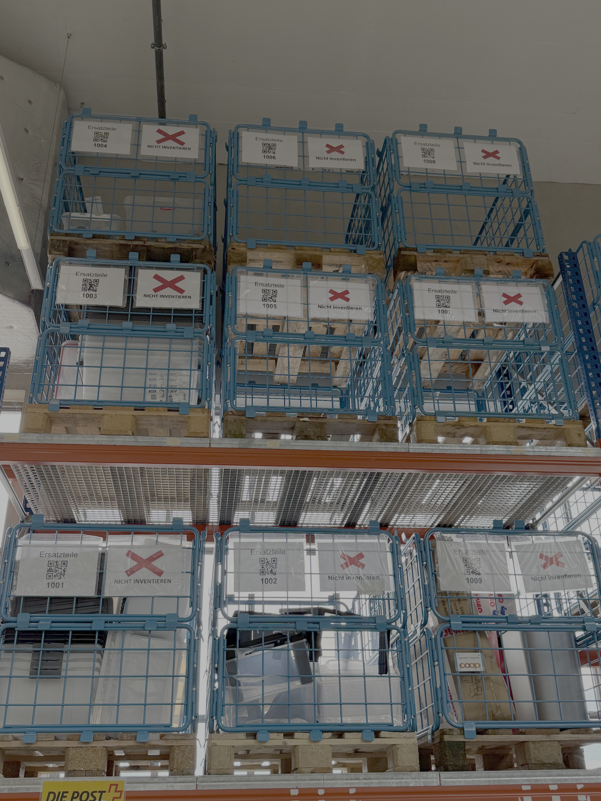
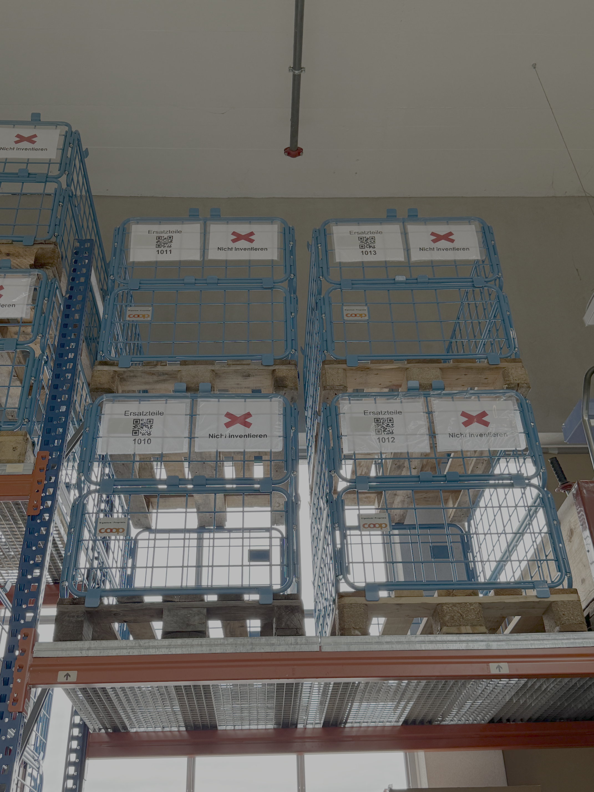

# Ersatzteile-PowerApp
Eine von mir erstellte PowerApp um für Online Nachlieferungen Ersatzeile organisiert einzulagern, zu finden und Kosten zu senken.

> Jahr: 2024–2026

> Plattform: Windows

> IDE: Microsoft Power Platform (Power Apps)

> Programmiersprache: PowerFX

## Das Projekt

Wenn wir defekte Ware nachliefern müssen, läuft dies über unsere Filiale in Arbon.
Wir hatten zwar ein bis zwei Paletten bei denen wir unter anderem einige Plastikdeckel aufbewahrt haben, aber es war sehr unsortiert.
Da die Nachlieferungen auch in meinen Zuständigkeitsbereich fallen, habe ich hier intervenieren müssen und angefangen ein "Lagersystem" zu erarbeiten.
Sofort habe ich es meinem Vorgesetzten vorgestellt und konnte es umsetzten.

Gestört haben mich vor allem  die vielen teuren Artikel die wir entsorgen mussten, nur wegen einer speziellen Schraube oder ein 5er-Set Plastikboxen weil bei der Lieferung ein einziger Deckel kaputt ging.

Von diesem Tag an, haben wir um die 13 Doppelrahmen Paletten die mit einem Lagerplatz beschriftet und sortiert sind.
Per Software lässt sich folgendes überprüfen:
- Was ist alles in der Palette?
- Ist der Artikel irgendwo hinterlegt?
- Welche Ersatzeile des Artikel sind vorhanden und wie viele?

## Das Programm

Das Programm ist simpel aufgebaut.
Oben hat es eine Suchleiste, und daneben einen Knopf um zwischen Artikel/Ersatzeil-Suche zu wechseln.
> [!NOTE]
> Bild folgt.

In der Suchleiste kann man nach Artikelnummer, Artikeltext, Lagerplatz oder Text suchen.
Findet man nichts, wechselt man zur Ersatzteil-Suche und kann es mit der Liter Anzahl, Markenname, Masse und anderem versuchen.
Solange es irgendwo hinterlegt ist, findet man es mit der Textsuche.

Hat man den Passenden Artikel gefunden, klickt man darauf und man gelangt in ein Menu wo folgendes angezeigt wird:
- Artikelbild
- Artikelnummer
- Artikelname
- Alle verfügbaren Einzelteile bei denen jeweils die Anzahl der verfügbaren Stückzahlen steht und einen minus/plus Knopf um das Teil ein- oder auszubuchen.
- Lagerplatz des jeweiligen Ersatzteil.
> [!NOTE]
> Bild Folgt.

Möchte man nun das Ersatzteil finden, nimmt man die Anzahl an benötigten Teile aus dem System und merkt sich den Lagerplatz der Palette.
Das Palett wird runtergenommen und das Ersatzteil kann herausgenommen werden.

  
   
  

> [!NOTE]
> Dieses Repo befindet sich noch im Aufbau.
